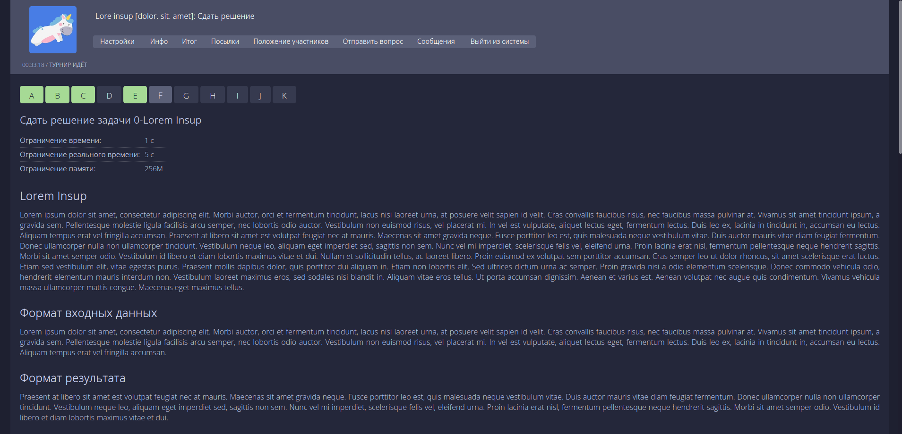

<h3 align="center">
	 
	
	Catppuccin for <a href="https://ejudge.algocode.ru/">Ejudge of Algocode</a>
	
</h3>

	

## Usage

1. Install Stylus extension for [Firefox](https://addons.mozilla.org/en-US/firefox/addon/styl-us/), [Chrome](https://chrome.google.com/webstore/detail/stylus/clngdbkpkpeebahjckkjfobafhncgmne) or [Opera](https://addons.opera.com/en-gb/extensions/details/stylus/)
2. Create new style applying to ejudge.algocode.ru
3. Copy contents of src/catppuccin-flavour.css
4. Done!

## Palettes

For palettes and style guide, refer to [Catppuccin repository](https://github.com/catppuccin/catppuccin).

## Technical details

For styling, CSS variables from [Catppuccin official CSS package](https://unpkg.com/@catppuccin/palette@0.1.4/css/catppuccin.css) are being used.

&nbsp;

Color Scheme Copyright &copy; 2021-present <a href="https://github.com/catppuccin" target="_blank">Catppuccin Org</a>

